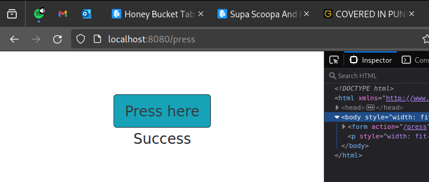

Create a Dockerfile for an old Java Spring project that can be found from the course repository.

The setup should be straightforward with the README instructions. Tips to get you started:

Use openjdk image `FROM openjdk:_tag_` to get Java instead of installing it manually. Pick the tag by using the README and Docker Hub page.

You've completed the exercise when you see a 'Success' message in your browser.

Submit the Dockerfile you used to run the container.

Steps I took:

- did `git clone https://github.com/docker-hy/material-applications`
- `cd material-applications/spring-example-project`
- linked my Dockerfile as `ln -s ../../ex1.11/Dockerfile Dockerfile`
    - could not build with linked Dockerfile as mentioned [here](https://github.com/moby/moby/issues/32041)
    - copied my Dockerfile over...
- built the image `docker build . -t ex1.11`
- ran it with `docker run -it -p 127.0.0.1:8080:8080 ex1.11`
- went over to `localhost:8080` in firefox and took the below screenshot after clicking the button

