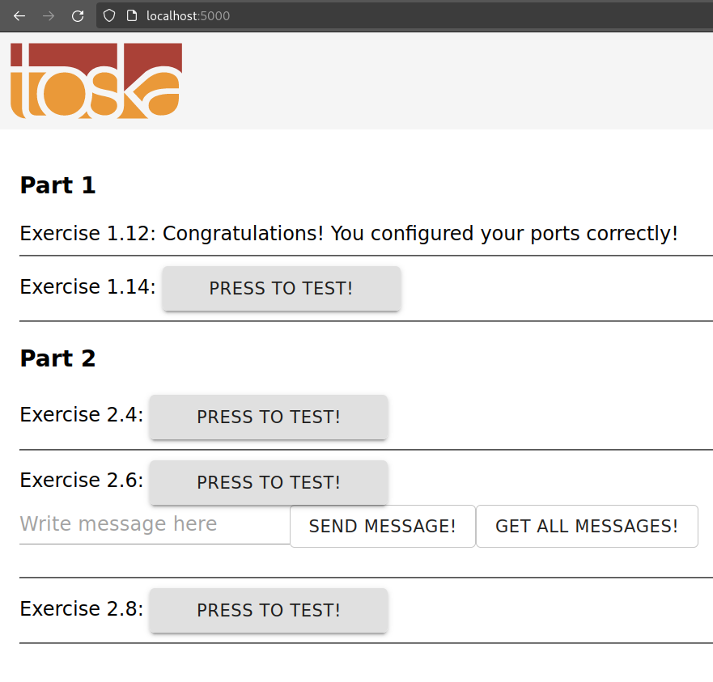

A good developer creates well-written READMEs. Such that they can be used to create Dockerfiles with ease.

Clone, fork or download the project from https://github.com/docker-hy/material-applications/tree/main/example-frontend.

Create a Dockerfile for the project (example-frontend) and give a command so that the project runs in a Docker container with port 5000 exposed and published so when you start the container and navigate to http://localhost:5000 you will see message if you're successful.

    note that the port 5000 is reserved in the more recent OSX versions (Monterey, Big Sur), so you have to use some other host port

Submit the Dockerfile.

Steps I took:

- copied over [material-applications/example-frontend/](https://github.com/docker-hy/material-applications/tree/main/example-frontend) to this dir, as docker refuses to follow symlinks
    - added it to .gitignore
- created the Dockerfile
- `docker build . -t ex1.12`
- `docker run -it -p 127.0.0.1:5000:5000 ex1.12`
- went over to firefox and took the below screenshot

