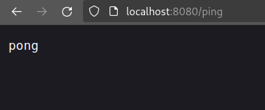

Clone, fork or download a project from https://github.com/docker-hy/material-applications/tree/main/example-backend.

Create a Dockerfile for the project (example-backend). Start the container with port 8080 published.

When you start the container and navigate to http://localhost:8080/ping you should get a "pong" as response.

Submit the Dockerfile and the command used.

Steps I took:

- copied over [material-applications/example-backend/](https://github.com/docker-hy/material-applications/tree/main/example-backend) to this dir
    - added it to .gitignore
- created the Dockerfile
- `docker build . -t ex1.13`
- `docker run -it -p 127.0.0.1:8080:8080 ex1.13`

