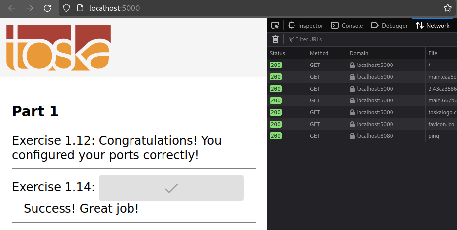

Start both frontend-example and backend-example with correct ports exposed and add ENV to Dockerfile with necessary information from both READMEs (front, back).

Ignore the backend configurations until frontend sends requests to `_backend_url_/ping` when you press the button.

You know that the configuration is ready when the button for 1.14 of frontend-example responds and turns green.

Do not alter the code of either project

Submit the edited Dockerfiles and commands used to run.

Steps I took:

- made [these changes](https://github.com/tomjtoth/DevOps-with-Docker/commit/fb2a0c35283a6f601a3ad8e4f82706d854c15a77) to the Dockerfiles
- rebuilt both images 
- 1st terminal: `docker run -it -p 127.0.0.1:8080:8080 ex1.13`
- 2nd terminal: `docker run -it -p 127.0.0.1:5000:5000 ex1.12`
- took the below screenshot from firefox http://localhost:5000 after clicking the button

