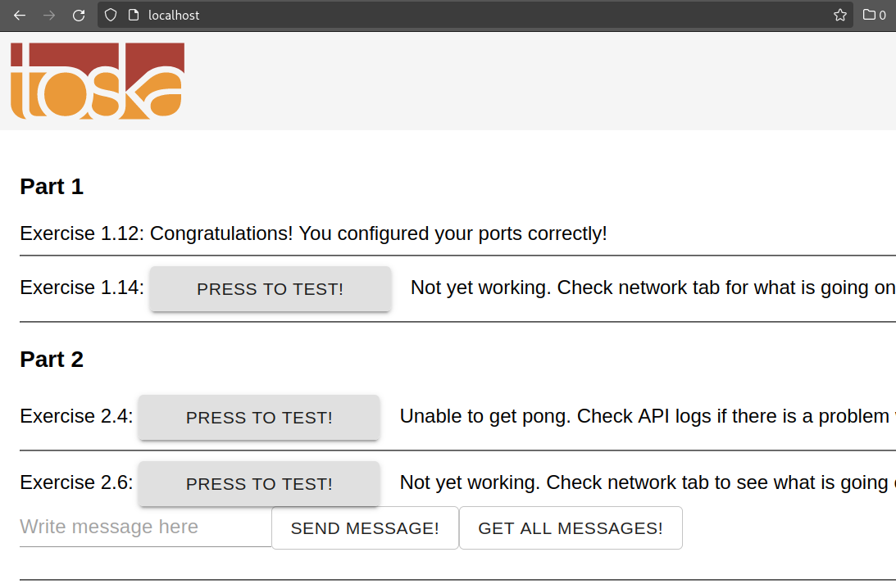

Copied over both `*.{yml,conf}` to the root of `material-applications`, also created the required `ex2.7+gp_data` (that really should be pg_data, typo, hmm) directory for postgres, then ran `docker compose up`

